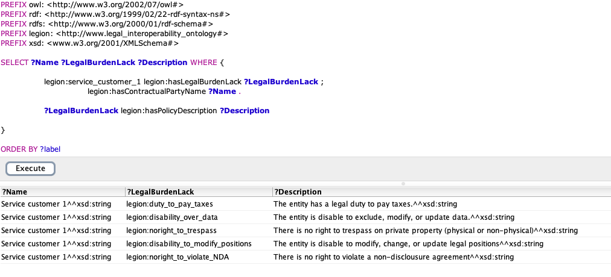

# Legal Interoperability Ontology for IDS - LegIOn-IDS
This repository contais the complete documentation of the proposed ontology. As an ongoing work, this ontology is one of the efforts towards the representation of a framework to foster the legal interoperability within IDS. We also provide an archive repository with all available work.

## Available Files:
```
.
├── README.md
├── final_ref_ontology (Reference Ontology)
├── final_operational_ontology (Operational Ontology)
├── ISO_dictionary (Glossary of terms, providing ISO reuse)
```


## In this repository:
[](#ontology-requirements-specification-document)

[](#ontology-engineering)

[](#sparql-queries-outcome)


## Ontology Requirements Specification Document


(SUÁREZ-FIGUEROA; GÓMEZ-PÉREZ; VILLAZÓN-TERRAZAS, 2009)
propose a systematic approach to document and set goals, granularity, and vocabulary
for the proposed ontology.


<p align=center>Source: Original Authorship (2024)</p>


<p align=center>Source: Original Authorship (2024)</p>


<p align=center>Source: Original Authorship (2024)</p>


## Ontology Engineering
As methodology for ontology development, we are grounded by the Systematic Approach for Building Ontologies (SABiO). The selected framework for ontology development SABiO describes the Ontology
development process in five development phases, and five support processes, that
are made to refine the phases without a sequential overflow (FALBO, 2014)


<p align=center>Source: (FALBO,2014)</p>


The Complete lifecycle development of LegIOn-IDS is summarized below:


<p align=center>Source: Original Authorship (2024)</p>


## SPARQL Queries Outcome
CQ1 (Informal): What are the legal entitlements of the service provider X? (GRIFFO et al., 2021)
</p>CQ1(Formal): 

<p align=center>Source: Original Authorship (2024)</p>

Observation: As a placeholder in the question, X is represented by 1 in this example. Hence, retrieving the legal entitlements of the service provider 1, for exemplification.

CQ2 (Informal): What are the legal burdens/lacks of the service provider X? (GRIFFO et al., 2021b)
</p>CQ2(Formal):

<p align=center>Source: Original Authorship (2024)</p>

Observation: As a placeholder in the question, X is represented by 1 in this example.
Hence, retrieving the legal burdens/lacks of the service provider 1, for exemplification

CQ3 (Informal): What are the legal entitlements of the service consumer X? (GRIFFO et al., 2021)
</p>CQ3(Formal):

<p align=center>Source: Original Authorship (2024)</p>

Observation: As a placeholder in the question, X is represented by 1 in this example.
Hence, retrieving the legal entitlements of the service consumer 1, for exemplification.

CQ4 (Informal): What are the legal burdens/lacks of the service consumer X?(GRIFFO et al., 2021)
</p>CQ4(Formal):

<p align=center>Source: Original Authorship (2024)</p>

Observation: As a placeholder in the question, X is represented by 1 in this example. Hence, retrieving the legal burdens/lacks of the service consumer 1, for
exemplification.

CQ5 (Informal): What are the Interoperability barriers in the service contract X?(EIF)
<p>CQ5(Formal): 

<p align=center>Source: Original Authorship (2024)</p>

Observation: As a placeholder in the question, X is represented by 1 in this example. Hence, retrieving the interoperability barriers of the service contract 1, for
exemplification.

CQ6 (Informal): What contracts represent joint controllership? (EIF)
</p>CQ6(Formal):

<p align=center>Source: Original Authorship (2024)</p>

Observation: The outcome is composed of the contracts characterized by the purpose of joint controllership.

CQ7 (Informal): What are the data user’s permissions and duties? (BADER et al., 2020)
</p>CQ7(Formal)(permissions):

<p align=center>Source: Original Authorship (2024)</p>
and
CQ7(Formal)(duties):

<p align=center>Source: Original Authorship (2024)</p>

Observation: Similarly, we propose the requiring of a specific data user, in this example, we retrieved the duties and permission of the service consumer (which is the data user) 2.

CQ8 (Informal): What contracts characterize data rent? (RAM)
</p>CQ8(Formal):

<p align=center>Source: Original Authorship (2024)</p>

Observation: The outcome is composed of the contracts of type Data Rent, which is defined as data as a service.

CQ9 (Informal): WWhat contracts characterize data purchase (RAM)?
</p>CQ9(Formal):

<p align=center>Source: Original Authorship (2024)</p>

Observation: The outcome is composed of the contracts of type Data Purchase.


### References
SUáREZ-FIGUEROA, M.; GOMEZ-PEREZ, A.; TERRAZAS, B. V. How to Write
and Use the Ontology Requirements Specification Document. [S.l.: s.n.], 2009. v. 5871.
982 p. ISBN 978-3-642-05150-0.